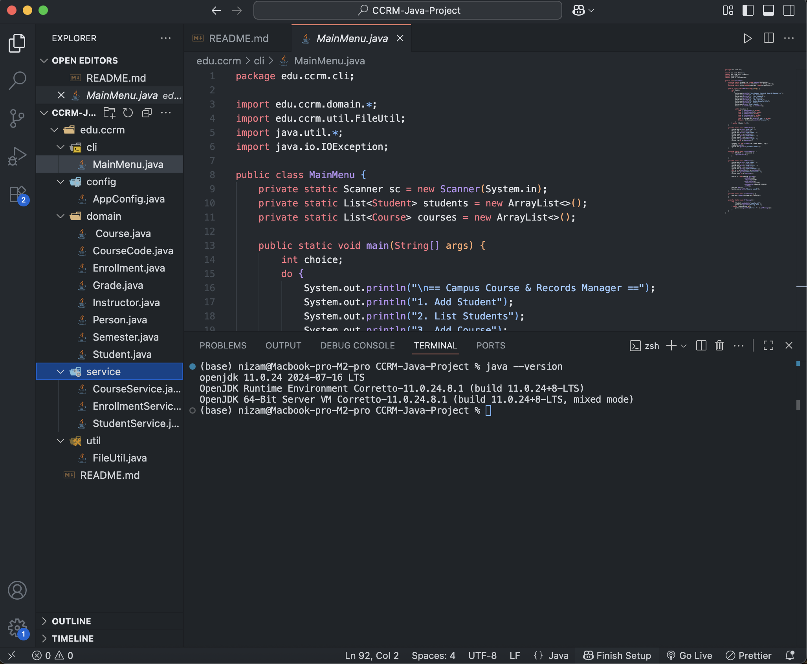

# Campus Course & Records Manager (CCRM)

# Project Overview
This is a console-based Java SE application to manage students, courses, enrollments, grades, and file operations.  
It demonstrates Object-Oriented Programming concepts (Encapsulation, Inheritance, Abstraction, Polymorphism) and Java SE features like Enums, Streams, NIO.2 File I/O, Date/Time API, Recursion, Exception Handling, and Design Patterns (Singleton, Builder).


# Project Structure

```
CCRM-Java-Project
 ├─ edu/
 │   └─ ccrm/
 │       ├─ cli/
 │       │   └─ MainMenu.java
 │       ├─ config/
 │       │   └─ AppConfig.java
 │       ├─ domain/
 │       │   ├─ Course.java
 │       │   ├─ CourseCode.java
 │       │   ├─ Enrollment.java
 │       │   ├─ Grade.java
 │       │   ├─ Instructor.java
 │       │   ├─ Person.java
 │       │   ├─ Semester.java
 │       │   └─ Student.java
 │       ├─ service/
 |       |       ├─ StudentService.java
 │       |       ├─ CourseService.java
 │       |       └─ EnrollmentService.java
 │       └─ util/
 │           └─ FileUtil.java
 ├─ screenshots/
 └─ README.md  
 
 ```

# Setup & Running

# Requirements
- JDK 17 (or higher)
- VS Code (with Java Extension Pack) / Eclipse IDE

# Steps to Run
1. Open the folder `CCRM-Java-Project` in VS Code.  
2. Navigate to the file: 
        edu.ccrm/cli/MainMenu.java
3. Run the program. The menu-driven CLI will appear in the terminal.


# Evolution of Java
- 1995: Java 1.0 by Sun Microsystems  
- 2004: Java 5 introduced Generics, Enums  
- 2014: Java 8 introduced Streams, Lambdas  
- 2017: Oracle switched to 6-month releases  
- 2021+: Java 17, 21 (LTS versions)  

# Java Editions
| Edition               |    Use Case |

| Java SE               | Standard Edition (desktop/console apps)  |
| Java EE (Jakarta EE)  | Enterprise Edition (web apps, servers)   |
| Java ME               | Micro Edition (mobile, embedded devices) |

# JDK, JRE, JVM
- JVM: Java Virtual Machine –   executes `.class` bytecode  
- JRE: Java Runtime Environment –   JVM + libraries (for running)  
- JDK: Java Development Kit –   JRE + compiler + tools (for development)  


# Installation (Windows Example)
1. Download JDK from [Oracle](https://www.oracle.com/java/technologies/javase-downloads.html).  
2. Install and set `JAVA_HOME`.  
3. Verify installation:
        java -version
        javac -version

 # Mapping of Syllabus Topics → Code
 ```

 ```

| Topic           |  Where Used |

| Encapsulation   | `Student.java` (private fields + getters/setters) |

| Inheritance     | `Person → Student, Instructor` |

| Abstraction     | `Person.java` (abstract class with abstract method) |

| Polymorphism    | `printProfile()` overridden in Student/Instructor |

| Immutable class | `CourseCode.java` |

| Nested class    | `Course.Builder` (static nested class) |

| Enum            | `Grade.java`, `Semester.java` |

| Lambda & Stream | `courses.forEach(System.out::println)` in `MainMenu.java`   |

| Singleton       | `AppConfig.java` |

| Builder Pattern | `Course.Builder` |

| Exceptions      | `tryBackup()` in `MainMenu.java` |

| Custom Exception | (to be added, e.g., `MaxCreditLimitException`) |

| File I/O (NIO.2) | `FileUtil.java` |

| Recursion       | `folderSize()` in `FileUtil.java` |

| Date/Time API   | `admissionDate` in `Student.java` |

| Assertions      | `assert credits > 0 : "Credits must be positive";|
```


# Screenshots




        
# Eclipse Setup 
1. File → New → Java Project  
2. Name project: `CCRM-Java-Project`  
3. Copy source files into `edu/ccrm/...`  
4. Run `MainMenu.java`  

# Assertions
In code:
```java
assert credits > 0 : "Credits must be positive";

Run with assertions enabled:
        java -ea edu.ccrm.cli.MainMenu

             or 
# Compile all java files with package structure
        javac -d . $(find edu -name "*.java")

# Run the main program
        java edu.ccrm.cli.MainMenu


        


  
